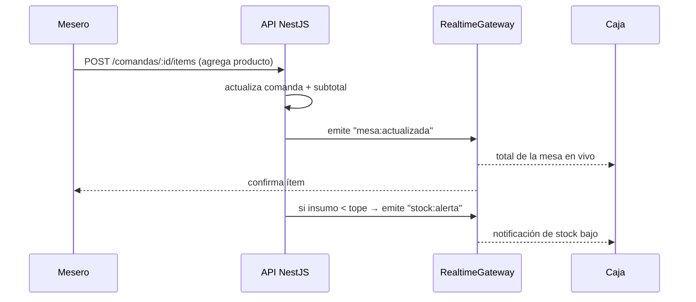
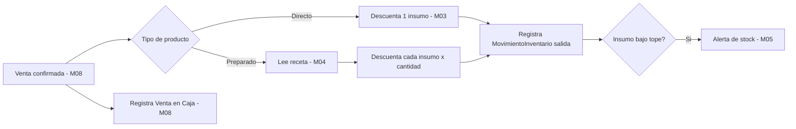

# Arquitectura — APP_VENTAS (TabernaPOS)

Aplicación web **auto-alojada (self-hosted)** que opera 100% en **red local (LAN/Wi-Fi)**, sin depender de internet. Un equipo servidor hospeda backend + frontend + base de datos; los dispositivos (celular, tablet, PC) acceden por navegador a la IP local.

---

## 1. Vista general (despliegue en red local)

```
┌─────────────────────────────────────────────────────────────┐
│                     Red local del bar (Wi-Fi)                │
│                                                              │
│   📱 Mesero        📱 Mesero        💻 Caja      🖥️ Admin     │
│   (navegador)      (navegador)     (navegador)  (navegador)  │
│        │               │               │            │        │
│        └───────────────┴───────┬───────┴────────────┘        │
│                                 │ HTTP / WebSocket            │
│                  ┌──────────────▼──────────────┐             │
│                  │      Equipo Servidor         │             │
│                  │  ┌────────────────────────┐  │             │
│                  │  │   Frontend (PWA build) │  │             │
│                  │  ├────────────────────────┤  │             │
│                  │  │   API NestJS (módulos) │  │             │
│                  │  ├────────────────────────┤  │             │
│                  │  │   SQLite (archivo .db) │  │             │
│                  │  └────────────────────────┘  │             │
│                  │  🖨️ Impresora térmica (opc.) │             │
│                  └──────────────────────────────┘             │
└─────────────────────────────────────────────────────────────┘
```

- El **equipo servidor** (PC o mini-PC siempre encendido) hospeda todo.
- Los dispositivos acceden por la IP local (ej. `http://192.168.1.50:3000`).
- **WebSockets** mantienen sincronizadas mesas, comandas y stock en tiempo real.

---

## 2. Stack tecnológico

| Capa | Recomendación | Alternativa |
|---|---|---|
| **Backend** | Node.js + **NestJS** (modular) | FastAPI (Python) |
| **Base de datos** | **SQLite** (archivo único, cero config) | PostgreSQL |
| **ORM** | Prisma | TypeORM / SQLAlchemy |
| **Frontend** | **React + Vite + TypeScript** (PWA) | Vue 3 |
| **UI** | Tailwind CSS, *mobile-first* | — |
| **Tiempo real** | WebSockets (Socket.IO) | Polling |
| **Despliegue** | **Docker + docker-compose** | `pm2` |
| **Impresión** | Impresora térmica ESC/POS (red/USB) | PDF desde navegador |

**Justificación:** NestJS organiza el código en módulos independientes que coinciden con la división M01–M12. SQLite elimina la administración de un motor de BD aparte (una sola sede). La PWA permite "instalar" la app en celulares/tablets sin tienda de aplicaciones.

---

## 3. Arquitectura del backend (NestJS modular)

Cada módulo funcional es un módulo NestJS aislado, con su `controller` (HTTP), `service` (lógica) y acceso a datos vía Prisma.

```
backend/  (NestJS)
├── prisma/
│   └── schema.prisma        # modelo de datos (ver docs/modelo-de-datos.md)
└── src/
    ├── auth/                # M01 — login, JWT, guards por rol
    ├── usuarios/            # M01
    ├── productos/           # M02
    ├── categorias/          # M02
    ├── inventario/          # M03 — insumos + movimientos
    ├── recetas/             # M04 — fichas técnicas / descuento de insumos
    ├── alertas/             # M05 — estado de stock + emisión por WS
    ├── mesas/               # M06
    ├── comandas/            # M07
    ├── ventas/              # M08
    ├── caja/                # M08 — apertura/cierre/arqueo
    ├── reportes/            # M09
    ├── proveedores/         # M10
    ├── configuracion/       # M11 — INC, propina, datos del local
    ├── auditoria/           # M12 — bitácora + backups
    └── realtime/            # WebSockets (gateway Socket.IO)
```

### Capas por módulo
```
HTTP Request → Controller → Service → Prisma → SQLite
                   │            │
                   │            └── emite eventos → RealtimeGateway (WS)
                   └── Guard (rol) valida permiso (M01)
```

---

## 4. Arquitectura del frontend (React PWA)

```
frontend/  (React + Vite + Tailwind, PWA)
└── src/
    ├── modules/
    │   ├── auth/            # login / PIN
    │   ├── menu/            # catálogo (M02)
    │   ├── inventario/      # stock, alertas, compras (M03/M05/M10)
    │   ├── mesas/           # tablero de mesas (M06)
    │   ├── comandas/        # toma de pedidos (M07)
    │   ├── caja/            # cobro y arqueo (M08)
    │   └── reportes/        # informes (M09)
    ├── components/          # UI reutilizable
    └── services/            # cliente API (HTTP) + cliente de sockets (WS)
```

- **Mobile-first**, instalable como PWA en cada dispositivo.
- `services/` centraliza llamadas REST y la conexión WebSocket.

---

## 5. Comunicación en tiempo real y resiliencia de red

El sistema utiliza **Socket.IO** sobre WebSockets para mantener la sincronización en tiempo real. Al operar en red local (LAN/Wi-Fi), se prevén caídas temporales de señal debido al desplazamiento de los meseros.

### Estrategia de reconexión y conciliación de estado:
1. **Configuración de Cliente (PWA):**
   - El cliente Socket.IO se inicializa con `reconnection: true`, `reconnectionAttempts: Infinity`, y `reconnectionDelay: 1000` (con backoff exponencial) para asegurar que reconecte automáticamente en cuanto recupere señal Wi-Fi.
2. **Eventos de sincronización tras reconexión:**
   - Al reconectar (`socket.on('reconnect')`), el frontend realiza una petición HTTP `GET /mesas` y `GET /caja/estado` para refrescar el estado local completo (conciliación) y evitar datos obsoletos en pantalla.
3. **Mensajería offline:**
   - Los pedidos realizados mientras no hay red local se guardan temporalmente en la memoria del dispositivo (IndexedDB / LocalStorage) y se encolan con una marca temporal para sincronizarse en cuanto retorne la conexión.



Eventos clave: `mesa:actualizada`, `comanda:actualizada`, `stock:alerta`, `caja:actualizada`.

---

## 6. Flujo de datos de una venta (descuento de inventario)



---

## 7. Integración de Hardware e Impresión Térmica

Dado que el servidor opera en un entorno local y autónomo, la impresión física se gestiona de forma directa:

1. **Protocolo ESC/POS:**
   - El backend NestJS genera la trama de impresión en formato binario plano usando comandos estándares **ESC/POS** (cortado de papel, negrita, alineación, tamaño de letra, impresión de logo).
2. **Métodos de Conexión de Impresoras:**
   - **Impresora de Red (Ethernet/Wi-Fi):** Conexión vía Sockets TCP directos en el puerto crudo `9100` (IP estática de la impresora). Es el método recomendado para comandas de barra y facturación en caja.
   - **Impresora USB local:** En el equipo servidor local, se puede usar un driver de sistema o escribir directo al puerto serial/USB montado en el contenedor Docker.
3. **Cola de Impresión (Queue Management):**
   - Las solicitudes de impresión se encolan en memoria en el backend (ej. usando un módulo ligero como `bull` o una cola en memoria en NestJS) para evitar colisiones de impresión simultánea en el mismo hardware.

---

## 8. Resiliencia de la Base de Datos (SQLite)

Aunque SQLite es de archivo único, requiere configuraciones de producción para soportar la concurrencia de hasta 15 usuarios concurrentes leyendo y escribiendo comandas:

1. **Modo WAL (Write-Ahead Logging):**
   - Se activa obligatoriamente al arrancar la aplicación (`PRAGMA journal_mode=WAL;`). Esto permite que múltiples meseros lean las comandas y mesas simultáneamente mientras el cajero o la barra realizan escrituras sin bloquear la base de datos (`database is locked`).
2. **Sincronización síncrona reducida:**
   - Configurado en `PRAGMA synchronous=NORMAL;` para un excelente rendimiento en escrituras rápidas y garantizar integridad contra fallos de software.
3. **Backups del Archivo `.db`:**
   - En lugar de detener el sistema, se utiliza la utilidad de backup en línea de SQLite o Prisma para generar una copia exacta en caliente.

---

## 9. Despliegue (Docker)

```
docker-compose.yml
└── servicio único (o backend + frontend):
    ├── Backend NestJS  → expone API + WS (puerto 3000)
    ├── Frontend build  → servido como estáticos (PWA)
    └── Volumen         → archivo SQLite persistente + carpeta de backups
```

Pasos: `docker-compose up -d` en el servidor → acceder desde la red en `http://<IP-servidor>:3000`. Se recomienda IP estática en el router y backup programado del archivo SQLite.

---

## 10. Estrategia de ramas (Git)

| Rama | Propósito |
|---|---|
| **main** | Código estable / producción (lo que corre en el establecimiento). |
| **staging** | Pre-producción: integración y pruebas antes de pasar a `main`. |
| **dev** | Desarrollo activo del día a día; de aquí salen las features. |

Flujo sugerido: `feature/* → dev → staging → main`.

---

## 11. Requerimientos no funcionales (resumen)

| Categoría | Requerimiento |
|---|---|
| Multidispositivo | Responsive *mobile-first* (celular, tablet, PC). |
| Tiempo real | Sincronización WebSockets y conciliación en reconexiones en segundos. |
| Disponibilidad | 100% en red local, sin internet. |
| Rendimiento | API < 300 ms. SQLite en modo WAL para alta concurrencia. |
| Seguridad | Hash de contraseñas, control de acceso por rol, PIN rápido de meseros. |
| Confiabilidad | Backups automáticos programados (cron local), tolerancia a pérdida temporal de Wi-Fi. |
| Instalabilidad | Despliegue con un solo comando (docker-compose). |
| Hardware local | Soporte de impresión física ESC/POS directo por TCP (puerto 9100) o USB. |
| Localización | Moneda COP, textos y reportes en español. |
