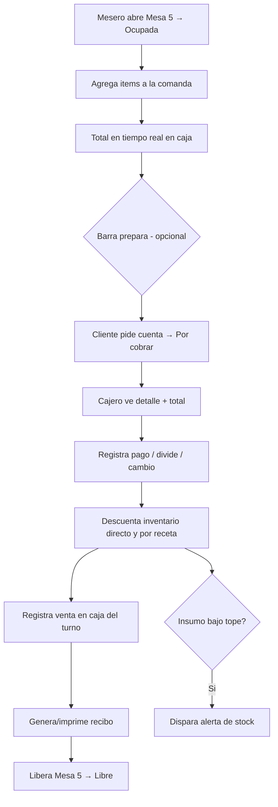

# Flujo 1 — Atención de una mesa (pedido → cobro)

**Módulos:** [M06](../modulos/M06-gestion-mesas.md) · [M07](../modulos/M07-comandas-pedidos.md) · [M04](../modulos/M04-recetas-fichas-tecnicas.md) · [M03](../modulos/M03-inventario.md) · [M08](../modulos/M08-ventas-cobro-caja.md) · [M05](../modulos/M05-alertas-stock.md)

## Pasos
1. Mesero abre **Mesa 5** (estado → *Ocupada*).
2. Agrega ítems a la comanda (2 cervezas, 1 cuba libre, 1 picada).
3. La comanda y el total se reflejan **en tiempo real** en caja y otros dispositivos.
4. (Opcional) La barra ve la comanda y prepara.
5. Cliente pide la cuenta → mesa pasa a *Por cobrar*.
6. Cajero abre la cuenta: ve **el detalle de lo pedido** y el **total** (subtotal + INC + propina).
7. Cajero registra el pago (método, divide cuenta si aplica, calcula cambio).
8. El sistema:
   - Descuenta insumos del inventario (cervezas directas; ron/gaseosa/lima por receta del cuba libre).
   - Registra la venta en la caja del turno.
   - Genera/imprime el recibo.
   - Libera la **Mesa 5** (estado → *Libre*).
9. Si algún insumo cruzó su tope, se dispara la **alerta de stock**.

## Diagrama

## Resultado esperado
- Cuenta cobrada con detalle y total correctos.
- Inventario descontado y caja actualizada.
- Mesa liberada y alertas disparadas si aplica.
