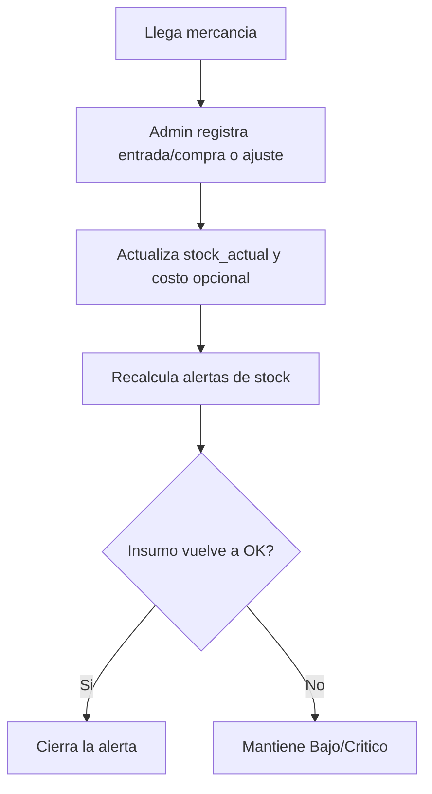

# Flujo 2 — Reabastecimiento de inventario

**Módulos:** [M10](../modulos/M10-compras-proveedores.md) · [M03](../modulos/M03-inventario.md) · [M05](../modulos/M05-alertas-stock.md)

## Pasos
1. Llega mercancía → Administrador registra una **entrada** (compra) o ajuste.
2. Se actualiza `stock_actual` y, opcionalmente, el costo.
3. Las alertas activas se **recalculan**.

## Diagrama

## Resultado esperado
- Stock actualizado con su movimiento de entrada registrado.
- Costo actualizado si aplica.
- Estado de alertas recalculado.
