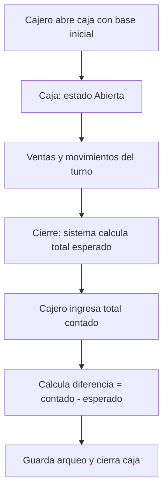

# Flujo 3 — Apertura y cierre de caja

**Módulos:** [M08](../modulos/M08-ventas-cobro-caja.md) · [M01](../modulos/M01-autenticacion-usuarios.md)

## Pasos
1. Cajero **abre caja** con base inicial.
2. Durante el turno se registran ventas y movimientos de caja (ingresos/egresos).
3. Al cerrar: el sistema muestra el **total esperado**; el cajero ingresa el **contado**; se calcula la **diferencia** y se guarda el **arqueo**.

## Diagrama

## Resultado esperado
- Caja abierta con base, ventas asociadas a esa caja.
- Arqueo guardado con esperado, contado y diferencia.
