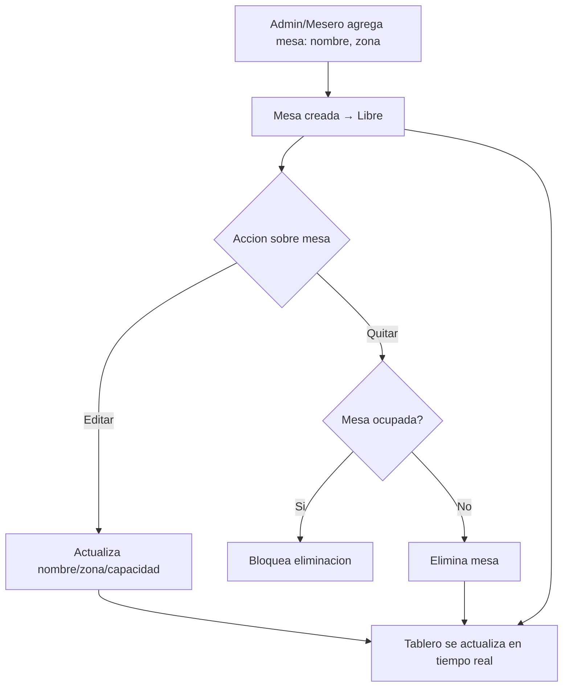

# Flujo 4 — Gestión de mesas (agregar / quitar)

**Módulos:** [M06](../modulos/M06-gestion-mesas.md) · [M01](../modulos/M01-autenticacion-usuarios.md)

## Pasos
1. Administrador/Mesero **agrega** una mesa nueva (nombre, zona).
2. Puede editar o **quitar** mesas que no estén ocupadas.
3. El **tablero de mesas** se actualiza para todos en tiempo real.

## Diagrama

## Resultado esperado
- Mesas agregadas/editadas/eliminadas según su estado.
- Tablero sincronizado en tiempo real en todos los dispositivos.
