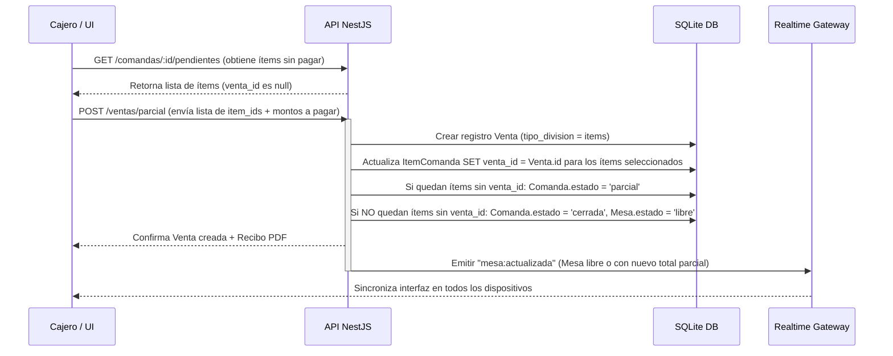

# Flujo 5 — División de Cuentas

**Módulos:** [M08](../modulos/M08-ventas-cobro-caja.md) · [M07](../modulos/M07-comandas-pedidos.md)

Este flujo detalla cómo se gestiona el cobro cuando los clientes en una misma mesa desean pagar por separado. El sistema soporta dos modalidades.

---

## 5.1 División por Partes Iguales (Valor)

Se utiliza cuando la cuenta se divide a partes iguales (ej. entre 3 personas), sin importar qué consumió cada uno.

### Pasos:
1. El cajero selecciona la opción **Dividir cuenta → Por partes iguales**.
2. Especifica el número de partes (ej. `N = 3`).
3. El sistema calcula automáticamente el total por persona: `Total Individual = Total Mesa / N`.
4. El cajero procede a cobrar cada parte secuencialmente:
   - Registra el método de pago para el Cliente 1 (ej. Efectivo).
   - Genera una entidad `Venta` con `tipo_division = partes`, `fraccion_pago = 1/N`, y el subtotal/total prorrateado.
   - Imprime el recibo parcial para el Cliente 1.
   - La `Comanda` cambia de estado `abierta` a `parcial`.
   - Se repite para los Clientes 2 y 3.
5. Al cobrarse la última fracción (`fraccion_pago` acumulado = `1.0` o suma de ventas = total comanda), la `Comanda` pasa a estado `cerrada` y la `Mesa` se libera (estado `libre`).

---

## 5.2 División por Selección de Ítems (Consumo Individual)

Se utiliza cuando cada persona paga exactamente lo que consumió.

### Pasos:
1. El cajero selecciona la opción **Dividir cuenta → Por selección de ítems**.
2. El sistema muestra la lista de todos los `ItemComanda` no liquidados (donde `venta_id IS NULL`).
3. El cajero asocia los ítems del primer pagador (ej. Cerveza ×2 y Picada ×0.5):
   - El sistema calcula el subtotal, INC y propina sugerida correspondiente únicamente a esos ítems.
   - Se procesa el pago y se crea una entidad `Venta` con `tipo_division = items`.
   - El sistema actualiza los `ItemComanda` seleccionados asignándoles el `venta_id` generado.
   - La `Comanda` pasa a estado `parcial`.
   - Se genera el recibo del primer pagador.
4. El proceso se repite para los ítems restantes.
5. Una vez que todos los `ItemComanda` de la `Comanda` tienen asignado un `venta_id` (todos están liquidados), el estado de la `Comanda` cambia a `cerrada` y la `Mesa` se libera (estado `libre`).

---

## Diagrama de Secuencia (División por Ítems)

## Resultados Esperados
- Cuentas parciales cobradas correctamente según la modalidad elegida.
- Auditoría e historial vinculan cada pago al cajero correspondiente.
- Control de caja actualizado inmediatamente por cada cobro fraccionado.
- Cierre total e inhabilitación de la comanda únicamente cuando el saldo pendiente es $0.
