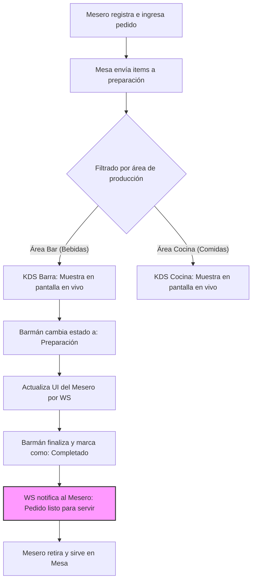

# Flujo 6 — KDS (Kitchen/Bar Display System)

**Módulos:** [M07](../modulos/M07-comandas-pedidos.md) · [M06](../modulos/M06-gestion-mesas.md)

Este flujo describe cómo interactúa el personal de preparación (barman / cocinero) con los pedidos enviados por los meseros a través de una pantalla táctil o monitor local, permitiendo sincronización instantánea y optimizando el servicio.

---

## 6.1 Flujo Operativo del Pedido en Cocina/Bar

### Pasos:
1. El mesero toma el pedido en la mesa y pulsa **Enviar a Preparación**.
2. El sistema:
   - Guarda los `ItemComanda` con estado inicial `pendiente`.
   - Emite el evento WebSocket `comanda:nueva` con los ítems filtrados por área de preparación (ej. Cócteles y Cervezas van al KDS del Bar; Hamburguesas y Picadas van al KDS de Cocina).
3. El monitor KDS respectivo muestra una tarjeta con:
   - Número de mesa y nombre del mesero.
   - Tiempo transcurrido (crono de preparación).
   - Detalle de ítems, cantidades y **notas especiales** (ej. *"Cuba Libre - sin hielo"* en rojo).
4. El preparador toca la pantalla sobre la tarjeta o ítem para iniciar la tarea:
   - El estado del ítem cambia a `preparacion`.
   - Se emite el evento WebSocket `item:estado_cambiado` para actualizar el panel de control del mesero.
5. Una vez terminado, el preparador toca **Completado**:
   - El estado del ítem pasa a `servido` (o listo para despacho).
   - Se emite una alerta WebSocket al mesero ("Mesa 5: Bebidas listas para servir").
   - La tarjeta desaparece del monitor KDS (se archiva).
6. Si todos los ítems de una comanda se completan, el crono de preparación total de esa comanda se detiene y se almacena en las métricas de servicio.

---

## Diagrama de Flujo (KDS en Tiempo Real)

## Beneficios e Integraciones Adicionales
- **Control de Tiempos:** Permite al administrador evaluar los tiempos promedio de preparación de bebidas y comidas en los reportes ([M09](../modulos/M09-informes.md)).
- **Resiliencia ante Apagones:** Si la tablet del KDS se apaga o reinicia, al iniciar consulta la API `GET /comandas/preparacion` recuperando el listado exacto de comandas pendientes en el mismo estado en el que estaban.
- **Ahorro de Papel:** Reemplaza la necesidad de tiqueteras térmicas en barra/cocina, centralizando todo digitalmente, aunque el sistema mantiene compatibilidad con impresión de tickets de preparación si se prefiere.
