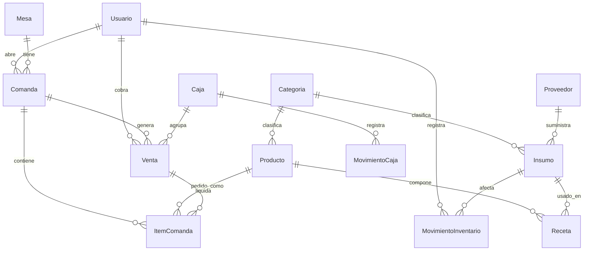

# Modelo de datos — Entidades principales

```
Usuario(id, nombre, usuario, password_hash, rol, pin, activo)

Categoria(id, nombre, tipo[producto|insumo])

Insumo(id, nombre, categoria_id, unidad_medida, stock_actual,
       stock_minimo, costo_unitario, proveedor_id?, activo,
       unidad_compra?, factor_conversion?) 
       // unidad_medida: ej. ml. unidad_compra: ej. Botella 750ml. factor_conversion: ej. 750.
       // Al registrar compras en M10, se ingresa en unidad_compra y se multiplica por factor_conversion para actualizar stock_actual.

Producto(id, nombre, descripcion, categoria_id, precio, costo?,
          tipo[directo|preparado], insumo_id?, imagen?, disponible,
          aplica_inc, inc_porcentaje) 
          // aplica_inc: boolean para saber si aplica el Impuesto Nacional al Consumo
          // inc_porcentaje: porcentaje de impuesto (ej. 8.0) para permitir exenciones o variaciones.

Receta(id, producto_id, insumo_id, cantidad)        // ficha técnica

Proveedor(id, nombre, contacto, telefono)

MovimientoInventario(id, insumo_id, tipo[entrada|salida|ajuste],
                     cantidad, costo_unitario?, motivo, usuario_id, fecha)
                     // cantidad siempre se registra en la unidad_medida base del Insumo (ej. ml).

Mesa(id, nombre, zona, capacidad?, estado[libre|ocupada|por_cobrar|reservada])

Comanda(id, mesa_id?, tipo[mesa|barra|llevar], estado[abierta|parcial|cerrada|anulada],
        usuario_id, fecha_apertura, fecha_cierre?)
        // estado parcial: indica que la comanda tiene cobros parciales realizados (división de cuenta).

ItemComanda(id, comanda_id, producto_id, cantidad, precio_unitario,
            notas, estado[pendiente|preparacion|servido], venta_id?)
            // venta_id?: apunta a la venta específica si se cobró en una división de cuenta por ítems.

Venta(id, comanda_id, subtotal, impuesto_inc, descuento, propina, total,
      metodo_pago, recibido?, cambio?, usuario_id, caja_id, fecha, 
      tipo_division[completo|partes|items], fraccion_pago?)
      // tipo_division: indica cómo se cobró.
      // fraccion_pago: si es por partes iguales, guarda la fracción (ej. 0.5 para la mitad).

Caja(id, usuario_apertura_id, base_inicial, fecha_apertura,
     fecha_cierre?, total_esperado?, total_contado?, diferencia?, estado[abierta|cerrada])

MovimientoCaja(id, caja_id, tipo[ingreso|egreso], monto, motivo, fecha)

Auditoria(id, usuario_id, accion, entidad, detalle, fecha)

Configuracion(clave, valor)   // parámetros del sistema (INC general, propina sugerida, datos de impresión, etc.)
```

## Relaciones clave

- `Producto (preparado) 1—N Receta N—1 Insumo`
- `Mesa 1—N Comanda 1—N ItemComanda`
- `Comanda 1—N Venta` (Una comanda puede generar múltiples ventas si se divide la cuenta)
- `Caja 1—N Venta`
- `Insumo 1—N MovimientoInventario`
- `Venta 1—N ItemComanda` (Relación opcional para identificar qué ítems fueron saldados en qué venta)

## Diagrama de relaciones



