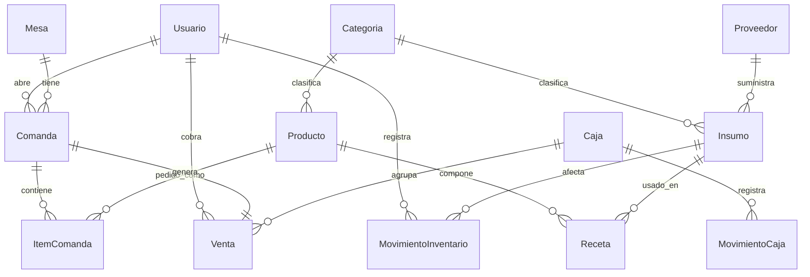

# Modelo de datos — Entidades principales

```
Usuario(id, nombre, usuario, password_hash, rol, pin, activo)

Categoria(id, nombre, tipo[producto|insumo])

Insumo(id, nombre, categoria_id, unidad_medida, stock_actual,
       stock_minimo, costo_unitario, proveedor_id?, activo)

Producto(id, nombre, descripcion, categoria_id, precio, costo?,
         tipo[directo|preparado], insumo_id?, imagen?, disponible)

Receta(id, producto_id, insumo_id, cantidad)        // ficha técnica

Proveedor(id, nombre, contacto, telefono)

MovimientoInventario(id, insumo_id, tipo[entrada|salida|ajuste],
                     cantidad, costo_unitario?, motivo, usuario_id, fecha)

Mesa(id, nombre, zona, capacidad?, estado[libre|ocupada|por_cobrar|reservada])

Comanda(id, mesa_id?, tipo[mesa|barra|llevar], estado[abierta|cerrada|anulada],
        usuario_id, fecha_apertura, fecha_cierre?)

ItemComanda(id, comanda_id, producto_id, cantidad, precio_unitario,
            notas, estado[pendiente|preparacion|servido])

Venta(id, comanda_id, subtotal, impuesto_inc, descuento, propina, total,
      metodo_pago, recibido?, cambio?, usuario_id, caja_id, fecha)

Caja(id, usuario_apertura_id, base_inicial, fecha_apertura,
     fecha_cierre?, total_esperado?, total_contado?, diferencia?, estado[abierta|cerrada])

MovimientoCaja(id, caja_id, tipo[ingreso|egreso], monto, motivo, fecha)

Auditoria(id, usuario_id, accion, entidad, detalle, fecha)

Configuracion(clave, valor)
```

## Relaciones clave

- `Producto (preparado) 1—N Receta N—1 Insumo`
- `Mesa 1—N Comanda 1—N ItemComanda`
- `Comanda 1—1 Venta`
- `Caja 1—N Venta`
- `Insumo 1—N MovimientoInventario`

## Diagrama de relaciones


